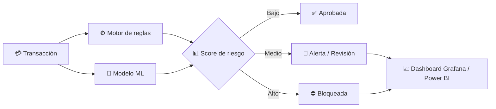

<!-- ═══════════════════ HEADER ANIMADO ═══════════════════ -->
<p align="center">
  
</p>

<!-- ═══════════════════ FOTO CON MARCO ═══════════════════ -->
<div align="center">
  <table>
    <tr>
      <td align="center" style="border-radius: 50%;">
        
      </td>
    </tr>
  </table>

  <a href="https://git.io/typing-svg">
    
  </a>

  <p>
    
    
    
    
  </p>

  <p>
    <a href="mailto:jpgarciiia964@gmail.com"></a>
    <a href="https://www.rootsystemtechnology.com"></a>
    
  </p>
</div>


## 👨🏻‍💻 Sobre mí

<table>
<tr>
<td width="60%" valign="top">

Desarrollador de software especializado en **Python, automatización, integración de sistemas y tecnología financiera**. Combino experiencia en **banca** con visión de **emprendedor**: diseño soluciones backend robustas, motores antifraude y plataformas empresariales que generan impacto real en el negocio.

```python
class JuanGarcia:
    role       = "Senior Python Developer"
    focus      = ["Fraud Prevention", "Backend", "Fintech", "ERP"]
    company    = {"APAP": "Developer", "RST": "CEO"}
    learning   = "Go"
    mindset    = "Negocio + Seguridad + Escalabilidad"

    def ask_me_about(self):
        return ["Python", "Node.js", ".NET", "Odoo", "Flutter", "T24"]
```

</td>
<td width="40%" valign="top">

**⚡ En pocas palabras**

- 🏦 Developer en **APAP**
- 🚀 CEO de **Root System Technology**
- 🛡️ Motores antifraude en tiempo real
- 🧠 Machine Learning aplicado a riesgo
- 🤝 Abierto a colaborar en **fintech, ERP y automatización**

</td>
</tr>
</table>

## 🛡️ Experiencia en Prevención de Fraude Bancario

<div align="center">

| 🔍 Detección | 📈 Riesgo | ⚙️ Operación |
|:---|:---|:---|
| Anomalías transaccionales con reglas y modelos analíticos | Scoring de riesgo y segmentación de clientes | Diseño e implementación de motores antifraude |
| Análisis de comportamiento y geolocalización | Modelos con **TensorFlow** y **LightGBM** | Monitoreo y gestión de alertas en tiempo real |
| Device fingerprinting | Análisis sobre **SQL Server** y **Python** | Dashboards en **Power BI** y **Grafana** |

</div>

<details>
<summary><b>🧩 Ver flujo típico de un motor antifraude</b></summary>
<br>



</details>


## ⚙️ Tech Stack

<div align="center">

**Lenguajes & Frameworks**


**Datos, ML & Monitoreo**


**ERP, Banca & DevOps**


</div>

## 🎯 Áreas de Interés

<div align="center">

| 🛡️ Prevención de fraude | 🧱 Backend | 🤖 Automatización |
|:---:|:---:|:---:|
| **🏢 Soluciones ERP** | **🔗 Integración de APIs** | **🏗️ Arquitecturas fintech escalables** |

</div>


## 📊 GitHub Stats

<div align="center">
  
  
  <br/>
  
  <br/>
  
</div>

## 📫 Contacto

<div align="center">

<a href="mailto:jpgarciiia964@gmail.com"></a>
<a href="mailto:jpgarcia964@gmail.com"></a>
<a href="https://www.rootsystemtechnology.com"></a>

</div>

<!-- ═══════════════════ FOOTER ANIMADO ═══════════════════ -->
<p align="center">
  
</p>
