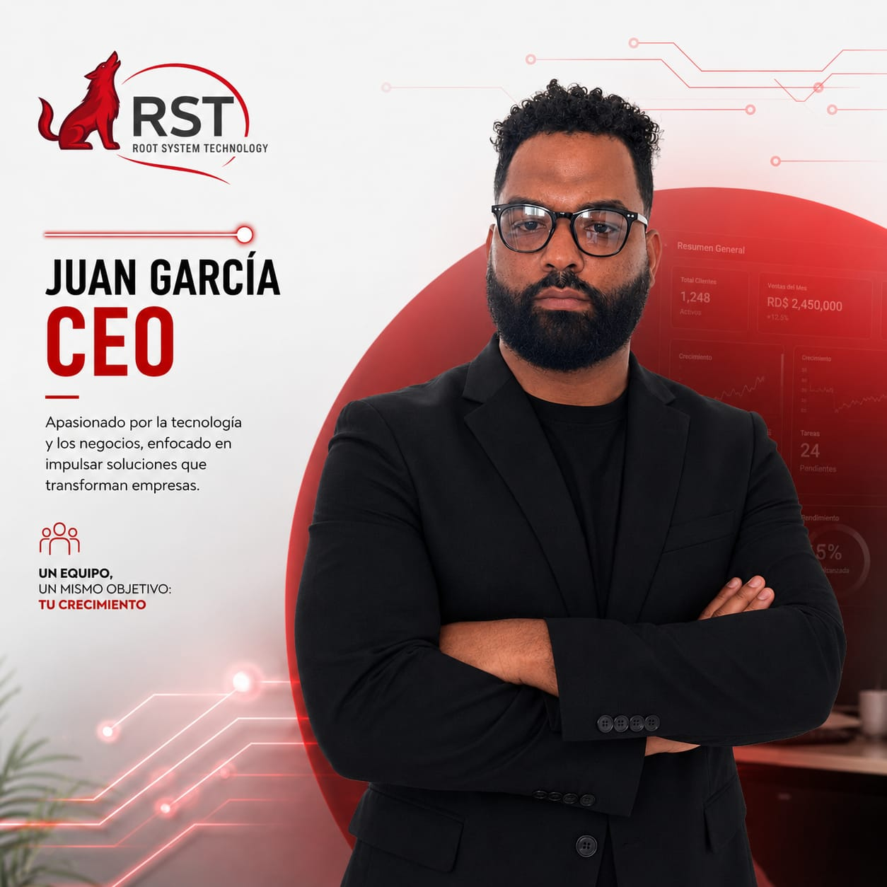
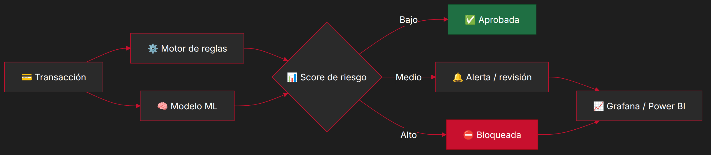

<div align="center">



</div>

<table>
<tr>
<td width="42%" align="center" valign="middle">



</td>
<td width="58%" valign="middle">

<a href="https://git.io/typing-svg"></a>

### Hola, soy Juan 👋

Apasionado por la **tecnología y los negocios**, enfocado en construir soluciones que **transforman empresas**.

Combino la experiencia en **banca y prevención de fraude** con la visión de **emprendedor**: diseño backends robustos, motores antifraude y plataformas empresariales sobre **Python y Odoo** que generan impacto real en el negocio.

   

> **Un equipo, un mismo objetivo: tu crecimiento.**

</td>
</tr>
</table>

<div align="center">

<a href="https://www.rootsystemtechnology.com"></a>
<a href="mailto:jpgarciiia964@gmail.com"></a>

</div>


## 📈 En números

<div align="center">



<sub>Totales reales de mis repos públicos y privados, actualizados cada día por una GitHub Action. Sin exponer nombres ni código.</sub>

</div>


## 👨🏻‍💻 Sobre mí

```python
class JuanGarcia:
    role     = "CEO @ Root System Technology · Senior Python Developer"
    based_in = "Santo Domingo, República Dominicana 🇩🇴"
    focus    = ["Antifraude", "Fintech", "ERP (Odoo)", "IA aplicada", "Backend"]
    company  = {"RST": "CEO & Founder", "APAP": "Developer"}
    learning = "Go 🦫"
    mindset  = "Negocio + Seguridad + Escalabilidad"

    def ask_me_about(self):
        return ["Python", "Odoo", "e-CF DGII", "Antifraude",
                "Node.js", ".NET", "Flutter", "Temenos T24"]

    def motto(self):
        return "Software que muerde los problemas, no a los usuarios. 🐺"
```

<table>
<tr>
<td width="50%" valign="top">

- 🐺 Fundador y CEO de **Root System Technology**
- 🏦 Developer en **APAP**
- 🛡️ Motores antifraude en tiempo real

</td>
<td width="50%" valign="top">

- 🧾 Facturación electrónica **e-CF** para la DGII
- 🧠 IA y Machine Learning aplicados a riesgo y operación
- 🤝 Abierto a colaborar en **fintech, ERP y automatización**

</td>
</tr>
</table>


## 🐺 Root System Technology: lo que construye la manada

<div align="center">

*Productos sobre **Odoo 16** y tecnología propia, diseñados en República Dominicana para empresas que quieren crecer.*

</div>

<table>
<tr>
<td width="33%" valign="top">

### 💰 Finanzas
- **Loan Management**: core de préstamos con caja, cobranza, mora y API móvil
- **Savings Suite**: cuentas de ahorro e intereses
- **Commission Management**: comisiones de ventas y POS
- **Due Manager**: CxC / CxP con semáforo
- **PriceGuard**: scoring comercial y control de precios

</td>
<td width="33%" valign="top">

### 🇩🇴 Cumplimiento RD
- **e-CF**: facturación electrónica DGII, firma, RFCE y contingencia
- **e-CF POS**: comprobantes desde la caja sin frenar la venta
- **Firma y Sello** automáticos en el e-CF
- **Régimen Simplificado (RST)**: Decreto 265-19
- **Nómina RD**: TSS, ISR, regalía, prestaciones y SUIR+

</td>
<td width="33%" valign="top">

### 🧠 IA y Seguridad
- **Neural Suite**: copiloto de IA que respeta los permisos de Odoo
- **VoucherGuard**: riesgo de manipulación de comprobantes bancarios
- **Planificación de Siembra**: demanda → fecha de siembra
- **Vaultix**: gestor de contraseñas Zero-Knowledge

</td>
</tr>
<tr>
<td valign="top">

### 🏭 Industria
- **Clínica Dental** con odontograma
- **Control de Obras** y analítica por proyecto
- **Inmobiliaria**: inventario y contratos por cuotas
- **POS Beauty Salon**: salones y barberías

</td>
<td valign="top">

### 🚀 Plataforma
- **RST SaaS**: Odoo como servicio con planes y límites
- **WConnect**: WhatsApp Business dentro de Odoo
- **TaskFlow**: tareas, horarios y escalamientos
- **FilaGo**: turnos con kiosco y pantalla

</td>
<td valign="top">

### 🎨 Experiencia
- **Website Starter**: sitio web premium
- **Login Experience**: login estilo Liquid Glass
- **Report Layouts**: documentos con tu marca
- **Propuestas RST**: cotización → propuesta en PDF

</td>
</tr>
</table>


## 🛡️ Experiencia en prevención de fraude bancario

<div align="center">

| 🔍 Detección | 📈 Riesgo | ⚙️ Operación |
|:---|:---|:---|
| Anomalías transaccionales con reglas y modelos analíticos | Scoring de riesgo y segmentación de clientes | Diseño e implementación de motores antifraude |
| Análisis de comportamiento y geolocalización | Modelos con **TensorFlow** y **LightGBM** | Monitoreo y gestión de alertas en tiempo real |
| Device fingerprinting | Análisis sobre **SQL Server** y **Python** | Dashboards en **Power BI** y **Grafana** |

</div>

<div align="center">



</div>


## ⚙️ Tech stack

<div align="center">



</div>


## 🧭 Cómo trabajo

<div align="center">

| 🔎 **1 · Descubrir** | 📐 **2 · Diseñar** | 🛠️ **3 · Construir** | ✅ **4 · Certificar** | 🤝 **5 · Acompañar** |
|:-:|:-:|:-:|:-:|:-:|
| Entender el negocio antes que el código | Arquitectura limpia, segura y escalable | Iteraciones cortas, código probado | QA, normativa (DGII, TSS) y seguridad | Implementación, capacitación y soporte |

<br/>


</div>


## 🐍 Actividad en GitHub

<div align="center">

<picture>
  <source media="(prefers-color-scheme: dark)" srcset="https://raw.githubusercontent.com/JpGarciiia964/JpGarciiia964/output/snake-dark.svg"/>
  <source media="(prefers-color-scheme: light)" srcset="https://raw.githubusercontent.com/JpGarciiia964/JpGarciiia964/output/snake-light.svg"/>
  
</picture>

<sub>🐍 La serpiente se come los commits mientras el lobo vigila 🐺 · Se actualiza sola cada día con una GitHub Action.</sub>

</div>


## 📫 Hablemos

<div align="center">

¿Tienes un proyecto de **fintech, ERP, facturación electrónica o automatización**? La manada está lista. 🐺

<a href="mailto:jpgarciiia964@gmail.com"></a>
<a href="mailto:jpgarcia964@gmail.com"></a>
<a href="https://www.rootsystemtechnology.com"></a>

<br/><br/>


<sub><b>Negocio · Seguridad · Escalabilidad</b></sub>

</div>
